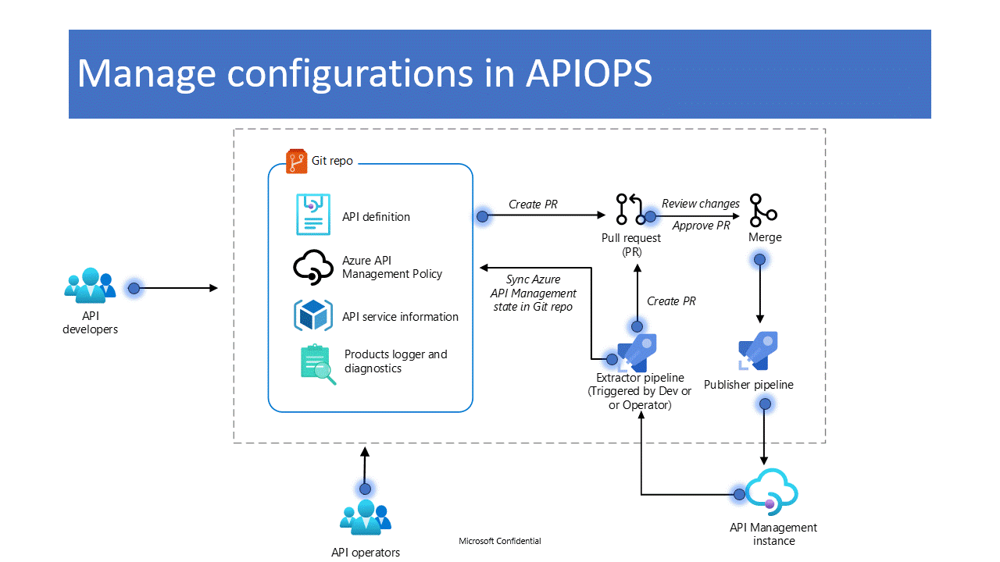

#  About this Tool

APIOps applies the concepts of DevOps to Azure API Management. This enables everyone involved in the lifecycle of API design, development, and deployment with self-service and automated tools to ensure the quality of the specifications and APIs that they're building. APIOps places the Azure API Management infrastructure under version control to achieve these goals. Rather than making changes directly in API Management portal, most operations happen through code changes that can be reviewed and audited. In this section, we include links to both a complementary Guide and Wiki to get you started with the tool.

Please bear in mind that APIOPS is designed to facilitate the promotion of changes across different Azure API Management (APIM) instances. While the animation below illustrates changes within the same instance, it's important to note that you can effortlessly apply your modifications across various Azure APIM instances using the supported configuration system. We advise taking some time to explore the [wiki](https://github.com/Azure/apiops/wiki/Configuration) and [documentation](https://azure.github.io/apiops/apiops/5-publishApimArtifacts/apiops-azdo-4-1-pipeline.html) to grasp the functioning of configuration overrides when promoting changes across different environments.

## Complementary Guide

This guide is designed to bring a 400-level understanding of automating API deployments in Azure Api Management. This is meant to be a hands-on lab experience, all instructions are provided, but a basic level of understanding of apis, devops and gitops is expected.
This guide will guide you through the concept of APIOps. It applies the concepts of GitOps and DevOps to API deployment. By using practices from these two methodologies, APIOps can enable everyone involved in the lifecycle of API design, development, and deployment with self-service and automated tools to ensure the quality of the specifications and APIs that they're building.
[This Guide is delivered using Github Pages and Just-The-Docs theme](https://azure.github.io/apiops/).

## Wiki

The Wiki covers all of our supported resources. Think about it as being more resource-focused with deeper dives, as opposed to the aforementioned guide which is more scenario-based and holistic. So in essence you need to read both to have a successful adoption of the tool. [The wiki can be found on wiki tab within this repo or by following this link](https://github.com/Azure/apiops/wiki).

# Roadmap

To stay up-to-date with the APIOps roadmap, please follow it closely.
To stay updated on the APIOps roadmap, please make sure to monitor it closely [here](https://github.com/Azure/apiops/projects?query=is%3Aopen).

# Contributing

This project welcomes contributions and suggestions.  Most contributions require you to agree to a
Contributor License Agreement (CLA) declaring that you have the right to, and actually do, grant us
the rights to use your contribution. For details, visit https://cla.opensource.microsoft.com.

When you submit a pull request, a CLA bot will automatically determine whether you need to provide
a CLA and decorate the PR appropriately (e.g., status check, comment). Simply follow the instructions
provided by the bot. You will only need to do this once across all repos using our CLA.

This project has adopted the [Microsoft Open Source Code of Conduct](https://opensource.microsoft.com/codeofconduct/).
For more information see the [Code of Conduct FAQ](https://opensource.microsoft.com/codeofconduct/faq/) or
contact [opencode@microsoft.com](mailto:opencode@microsoft.com) with any additional questions or comments.

# Supporting Tools

While the APIOPs tool does not have built-in support for promoting the migration of the APIM Dev Portal, there is another tool available that offers such functionality. We suggest you explore that tool which can be found [here](https://github.com/seenu433/apim-dev-portal-migration).

# Trademarks

This project may contain trademarks or logos for projects, products, or services. Authorized use of Microsoft 
trademarks or logos is subject to and must follow 
[Microsoft's Trademark & Brand Guidelines](https://www.microsoft.com/en-us/legal/intellectualproperty/trademarks/usage/general).
Use of Microsoft trademarks or logos in modified versions of this project must not cause confusion or imply Microsoft sponsorship.
Any use of third-party trademarks or logos are subject to those third-party's policies.
